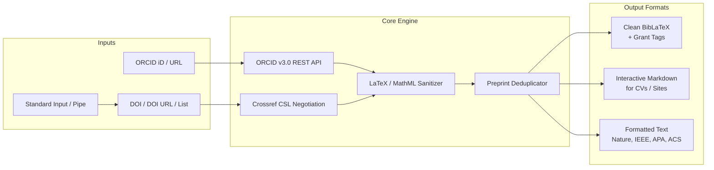

<div align="center">

# 📚 orcid2bib

**Universal, zero-dependency CLI tool and Python library to convert ORCID profiles and DOIs into clean BibTeX, Markdown, and formatted academic citations.**

[](https://www.python.org/)
[](LICENSE)
[-success.svg)](https://docs.python.org/3/library/)
[](pyproject.toml)
[]()

[Quick Start](#-quick-start) • [Features](#-key-features) • [Installation](#-installation) • [Usage Recipes](#-usage-recipes) • [Citation Styles](#-citation-styles) • [Python API](#-python-api) • [BibLaTeX](#-grant-reporting--biblatex-integration) • [FAQ](#-frequently-asked-questions)

---

</div>

## ⚡ Quick Start

```bash
# 1. Fetch an entire ORCID profile as clean BibTeX
orcid2bib 0000-0002-1825-0097 -o publications.bib

# 2. Filter publications from 2021 onwards
orcid2bib 0000-0002-1825-0097 -y 2021 -o recent_papers.bib

# 3. Resolve a DOI directly into BibTeX
orcid2bib 10.1016/j.actamat.2025.121319

# 4. Generate formatted text citations (Nature, IEEE, APA, ACS, etc.)
orcid2bib 0000-0002-1825-0097 -f text --style nature

# 5. Export a clickable Markdown publication list for your CV or website
orcid2bib 0000-0002-1825-0097 -f markdown -o cv_publications.md

# 6. Read DOIs from a pipe or standard input
cat dois.txt | orcid2bib - -o references.bib
```

---

## 🏗️ Architecture & Pipeline



---

## ✨ Key Features

- 📦 **Zero External Dependencies** — Built 100% on the Python Standard Library (`urllib`, `json`, `re`, `argparse`). No heavy HTTP or parsing dependencies needed.
- ⚡ **First-Class Executable & Package** — Install globally via `pip` / `pipx`, run directly as a standalone executable script (`./orcid2bib.py`), or execute via `python3 -m orcid2bib`.
- 🔄 **Smart Input Detection** — Seamlessly parses bare ORCID iDs (`0000-0002-1825-0097`), full ORCID URLs (`https://orcid.org/...`), single/multiple DOIs (`10.1016/...`), and piped standard input (`-`).
- 🧹 **LaTeX & MathML Sanitization** — Cleans XML entities and converts complex MathML tags into standard LaTeX math (e.g. `<mml:math><mml:mi>α</mml:mi></mml:math>` $\rightarrow$ `$\alpha$`, `$\Sigma$`).
- 🧠 **Intelligent Preprint Deduplication** — Identifies and suppresses preprint versions (arXiv, bioRxiv, ChemRxiv, Research Square) when peer-reviewed journal versions exist in the profile.
- 🏷️ **Grant-Ready BibLaTeX Categorization** — Injects `keywords = {quality_assured}` or `keywords = {other}` to instantly generate split CV/grant bibliographies (e.g., for DFG, EU Horizon, NSF).
- 🎨 **8+ Academic Citation Styles** — Outputs styled bibliographies in APA 7th, Nature, IEEE, ACS, Elsevier, Chicago, Harvard, and Springer formats.
- 📤 **Multiple Export Formats** — Produces structured `.bib`, clickable `.md` lists with DOI links, or styled plain text.

---

## 🚀 Installation

### Option 1: Install with `pip` / `pipx` (Recommended)

Install the latest release directly from GitHub:

```bash
# Global / virtualenv installation
pip install git+https://github.com/prnvrvs/orcid2bib.git

# Or isolated installation with pipx
pipx install git+https://github.com/prnvrvs/orcid2bib.git
```

### Option 2: Clone and Install Locally

```bash
git clone https://github.com/prnvrvs/orcid2bib.git
cd orcid2bib
pip install .
```

For editable development mode:
```bash
pip install -e .
```

### Option 3: Standalone Single-File Script (Zero Installation)

Because `orcid2bib` is self-contained with no dependencies, you can download `orcid2bib.py` directly and execute it anywhere:

```bash
# Download single script
curl -O https://raw.githubusercontent.com/prnvrvs/orcid2bib/main/orcid2bib.py
chmod +x orcid2bib.py

# Run directly:
./orcid2bib.py 0000-0002-1825-0097
```

### Option 4: Run as a Python Module

```bash
python3 -m orcid2bib 0000-0002-1825-0097
```

---

## 📖 Usage Recipes

### 1. 🆔 ORCID Profile Lookup

Fetch all publications for an ORCID profile and output clean BibTeX:

```bash
# Print to terminal
orcid2bib 0000-0002-1825-0097

# Save to a .bib file
orcid2bib 0000-0002-1825-0097 -o my_publications.bib

# Full ORCID URL is also accepted
orcid2bib https://orcid.org/0000-0002-1825-0097 -o my_publications.bib
```

---

### 2. 📅 Year Filtering

Filter works to match grant reporting periods, tenure reviews, or recent activity:

```bash
# Publications from 2021 to present
orcid2bib 0000-0002-1825-0097 -y 2021 -o recent.bib

# Publications within a specific year window (2020-2024)
orcid2bib 0000-0002-1825-0097 --min-year 2020 --max-year 2024 -o phd_papers.bib
```

---

### 3. 🔎 Direct DOI Resolution

Retrieve clean BibTeX for one or more DOIs:

```bash
# Single DOI
orcid2bib 10.1016/j.actamat.2025.121319

# Full DOI URL
orcid2bib https://doi.org/10.1016/j.actamat.2025.121319

# Multiple comma-separated DOIs
orcid2bib -d 10.1016/j.actamat.2025.121319,10.1016/j.ijhydene.2025.02.435 -o papers.bib
```

---

### 4. 🚰 Standard Input & Shell Pipelines

Pipe DOIs or ORCID iDs from other command-line tools:

```bash
# Pipe a single DOI
echo "10.1016/j.actamat.2025.121319" | orcid2bib -

# Batch process a text file of DOIs (one per line)
cat doi_list.txt | orcid2bib - -o bibliography.bib
```

---

### 5. 📝 Markdown Export (For CVs & Academic Websites)

Generate a numbered Markdown publication list with clickable DOI hyperlinks:

```bash
orcid2bib 0000-0002-1825-0097 -y 2021 -f markdown -o cv_publications.md
```

**Example Markdown Output:**
```markdown
# Publications from ORCID 0000-0002-1825-0097

1. **Hydrogen embrittlement mechanisms in high-strength alloys** (2025) — *Acta Materialia* ([DOI: 10.1016/j.actamat.2025.121319](https://doi.org/10.1016/j.actamat.2025.121319))
2. **Phase transformation dynamics under extreme strain** (2024) — *Nature Materials* ([DOI: 10.1038/s41563-024-00000-x](https://doi.org/10.1038/s41563-024-00000-x))
```

---

### 6. 📄 Styled Plain Text Bibliographies

Generate pre-formatted citations in your desired journal format:

```bash
# Default APA 7th style
orcid2bib 10.1016/j.actamat.2025.121319 -f text

# Nature style
orcid2bib 10.1016/j.actamat.2025.121319 -f text --style nature

# IEEE style
orcid2bib 10.1016/j.actamat.2025.121319 -f text --style ieee

# ACS style
orcid2bib 10.1016/j.actamat.2025.121319 -f text --style acs
```

---

### 7. 🔄 Controlling Preprint Deduplication

By default, `orcid2bib` suppresses preprints (e.g. arXiv, bioRxiv) if a corresponding journal article exists in the profile. To keep all raw entries without deduplication:

```bash
orcid2bib 0000-0002-1825-0097 --no-dedup -o all_raw_records.bib
```

---

### 8. 👥 Batch Processing for Research Teams

Fetch publications for an entire lab or research group using a simple Bash script:

```bash
#!/usr/bin/env bash

declare -A LAB_MEMBERS=(
  ["Prof_Smith"]="0000-0002-1825-0097"
  ["Dr_Johnson"]="0000-0001-5109-3700"
  ["Dr_Lee"]="0000-0003-1234-5678"
)

for NAME in "${!LAB_MEMBERS[@]}"; do
  ORCID="${LAB_MEMBERS[$NAME]}"
  echo "[*] Fetching publications for $NAME ($ORCID)..."
  orcid2bib "$ORCID" -y 2021 -o "${NAME}_publications.bib"
done
```

---

## 🎨 Citation Styles

| Style | Flag | Example Output |
| :--- | :--- | :--- |
| **APA 7th** *(default)* | `-s apa` | Smith, J., & Doe, J. (2024). Machine learning models... *Journal of Materials Science*, 59, 12048. |
| **Nature** | `-s nature` | 1. Smith, J. & Doe, J. Machine learning models... *Journal of Materials Science* **59**, 12048 (2024). |
| **IEEE** | `-s ieee` | [1] J. Smith and J. Doe, “Machine learning models...,” *Journal of Materials Science*, vol. 59, 2024. |
| **Elsevier** | `-s elsevier` | [1] J. Smith, J. Doe, Machine learning models..., *Journal of Materials Science* 59 (2024) 12048. |
| **ACS** | `-s acs` | (1) Smith, J.; Doe, J. Machine Learning Models... *Journal of Materials Science* **2024**, *59*, 12048. |
| **Chicago** | `-s chicago` | Smith, Jane, and John Doe. 2024. “Machine Learning Models...” *Journal of Materials Science* 59. |
| **Harvard** | `-s harvard` | Smith, J., Doe, J., 2024. Machine learning models... *Journal of Materials Science* 59, 12048. |
| **Springer** | `-s springer` | Smith J, Doe J (2024) Machine learning models... *Journal of Materials Science* 59:12048. |
| **MLA** | `-s mla` | Smith, Jane, and John Doe. "Machine Learning Models..." *Journal of Materials Science*, vol. 59, 2024. |

---

## 🧭 CLI Command-Line Reference

```text
usage: orcid2bib [-h] [-d DOI] [-y YEAR] [--max-year YEAR] [-o FILE]
                 [-f {bibtex,markdown,text,apa}] [-s STYLE] [--no-dedup] [-v]
                 [target]
```

| Argument / Flag | Short | Type | Default | Description |
| :--- | :---: | :---: | :---: | :--- |
| `target` | — | `str` | `None` | Positional target: ORCID iD, DOI, full URL, or `-` for stdin |
| `--doi` | `-d` | `str` | `None` | Explicit DOI or comma-separated list of DOIs |
| `--min-year` | `-y` | `int` | `None` | Include publications published in or after this year |
| `--max-year` | — | `int` | `None` | Include publications published up to this year |
| `--output` | `-o` | `str` | `stdout` | Write output to a specified file |
| `--format` | `-f` | `choice` | `bibtex` | Output format: `bibtex`, `markdown`, `text`, `apa` |
| `--style` | `-s` | `str` | `apa` | Citation style for `text` format (e.g. `nature`, `ieee`, `acs`) |
| `--no-dedup` | — | `flag` | `False` | Disable smart preprint deduplication |
| `--version` | `-v` | `flag` | — | Show program version and exit |
| `--help` | `-h` | `flag` | — | Show help message and usage examples |

---

## 🐍 Python API

`orcid2bib` can also be imported and used programmatically in any Python 3.7+ application:

```python
import orcid2bib

# 1. Query an ORCID profile
works = orcid2bib.fetch_orcid(
    "0000-0002-1825-0097",
    min_year=2021,
    dedup=True
)

for work in works:
    print(f"[{work['year']}] {work['title']} (DOI: {work['doi']})")

# 2. Convert DOI to clean, formatted BibTeX
bibtex_entry = orcid2bib.doi_to_bibtex(
    "10.1016/j.actamat.2025.121319",
    extra_keywords="quality_assured"
)
print(bibtex_entry)

# 3. Format DOI citation into a specific journal style
nature_citation = orcid2bib.doi_to_text(
    "10.1016/j.actamat.2025.121319",
    style="nature"
)
print(nature_citation)
```

---

## 📑 Grant Reporting & BibLaTeX Integration

`orcid2bib` automatically categorizes works by injecting `keywords = {quality_assured}` for peer-reviewed journal articles and `keywords = {other}` for preprints, conference proceedings, or unreviewed outputs.

This makes generating split academic CVs (such as for **DFG**, **EU Horizon Europe**, or **NSF** proposals) straightforward in LaTeX:

```latex
\documentclass[11pt,a4paper]{article}

\usepackage[utf8]{inputenc}
\usepackage[T1]{fontenc}
\usepackage{mathptmx}
\usepackage[margin=2.2cm]{geometry}

\usepackage[
  backend=biber,
  style=numeric,
  sorting=ydnt,
  maxbibnames=99,
  defernumbers=true
]{biblatex}

\addbibresource{publications.bib}

\begin{document}

\section*{Principal Investigator — List of Publications}
\nocite{*}

\subsection*{Category A: Peer-Reviewed & Quality-Assured Journal Publications}
\printbibliography[
  keyword=quality_assured,
  heading=none,
  resetnumbers=true
]

\subsection*{Category B: Preprints, Conference Proceedings & Other Works}
\printbibliography[
  keyword=other,
  heading=none,
  resetnumbers=true
]

\end{document}
```

**To compile:**
```bash
pdflatex publication_list.tex
biber publication_list
pdflatex publication_list.tex
```

---

## ❓ Frequently Asked Questions

<details>
<summary><b>Does orcid2bib require an ORCID API key or account?</b></summary>
<br>
No. Public ORCID profiles are queried directly through the public ORCID REST API v3.0, and DOI metadata is resolved via Crossref content negotiation without requiring an API key.
</details>

<details>
<summary><b>What happens if an ORCID publication has no DOI?</b></summary>
<br>
If a work in the ORCID record does not have an attached DOI, <code>orcid2bib</code> outputs a clear commented placeholder in the BibTeX file:
<pre><code>% Work without DOI: Title of Publication (Year)</code></pre>
This ensures no entries are silently dropped while keeping your <code>.bib</code> file syntactically valid.
</details>

<details>
<summary><b>How does preprint deduplication work?</b></summary>
<br>
Preprints (identified by journal titles containing <code>arxiv</code>, <code>biorxiv</code>, <code>chemrxiv</code>, <code>research square</code> or type <code>PREPRINT</code>) are fuzzy-matched against peer-reviewed articles in the same ORCID profile. If a published journal version exists, the preprint is automatically suppressed unless <code>--no-dedup</code> is specified.
</details>

<details>
<summary><b>Can I format citations in styles not listed above?</b></summary>
<br>
Yes. Any valid CSL (Citation Style Language) style identifier supported by the Crossref citation service can be passed directly to <code>--style</code> (e.g. <code>--style cell</code>, <code>--style pnas</code>).
</details>

---

## 📄 License

This project is licensed under the [MIT License](LICENSE) — feel free to use it in academic, open-source, and commercial projects.
